# Documentation Technique — Amali Mobile

> Application de rencontres halal — React + TypeScript + Supabase

---

## 1. Architecture générale

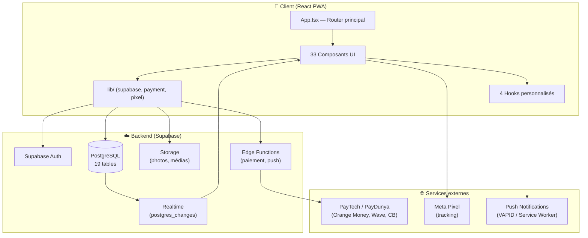

---

## 2. Navigation & Routing

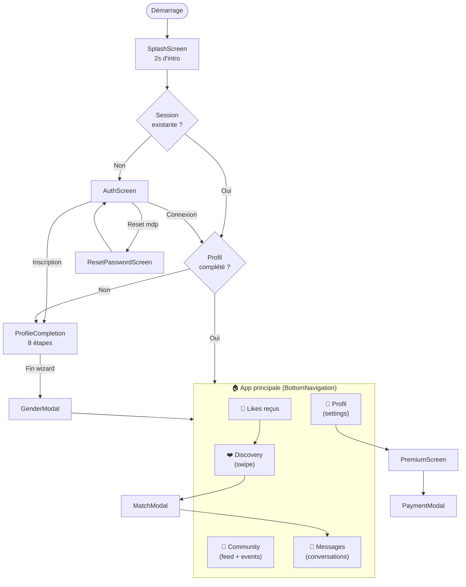

---

## 3. Flux d'authentification

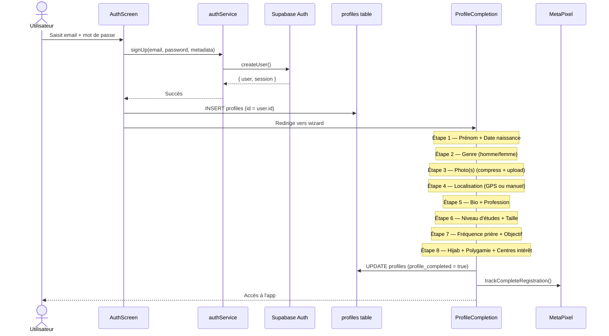

---

## 4. Discovery — Swipe de profils

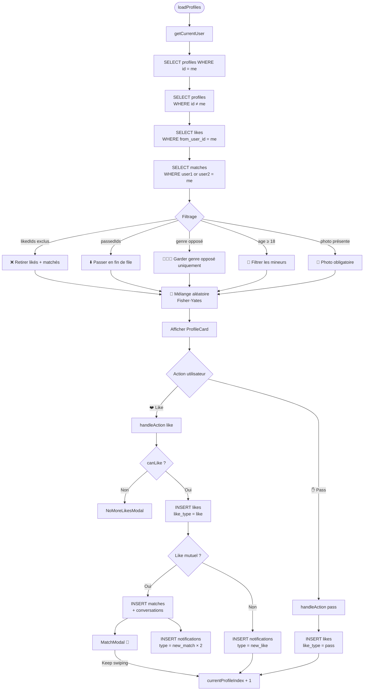

---

## 5. Système de Match

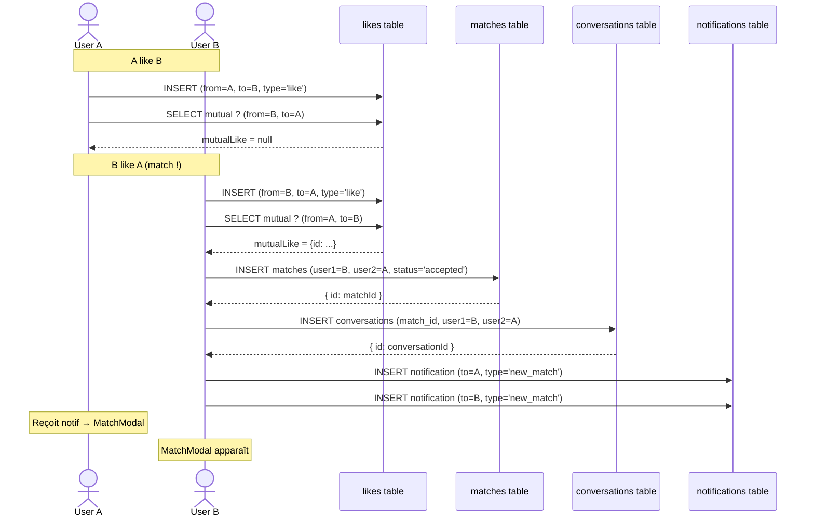

---

## 6. Messagerie temps réel

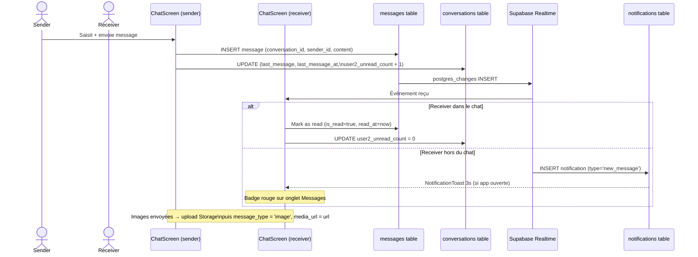

---

## 7. Système de notifications

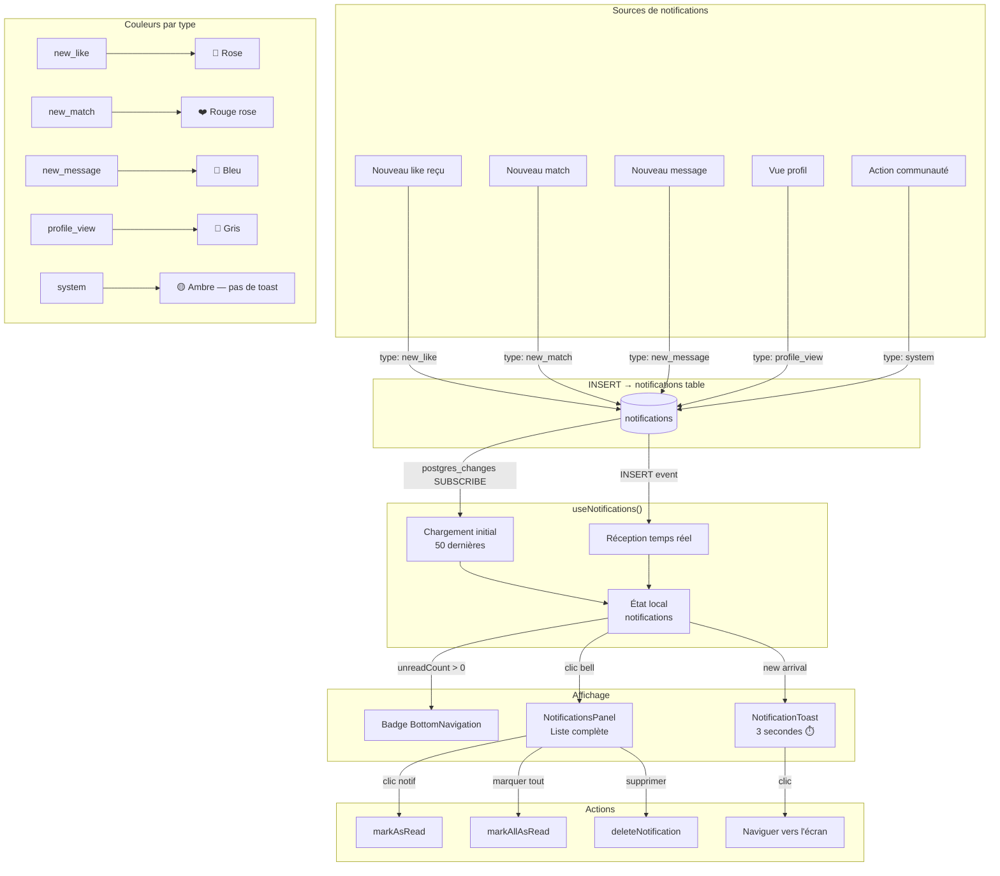

---

## 8. Premium & Paiement

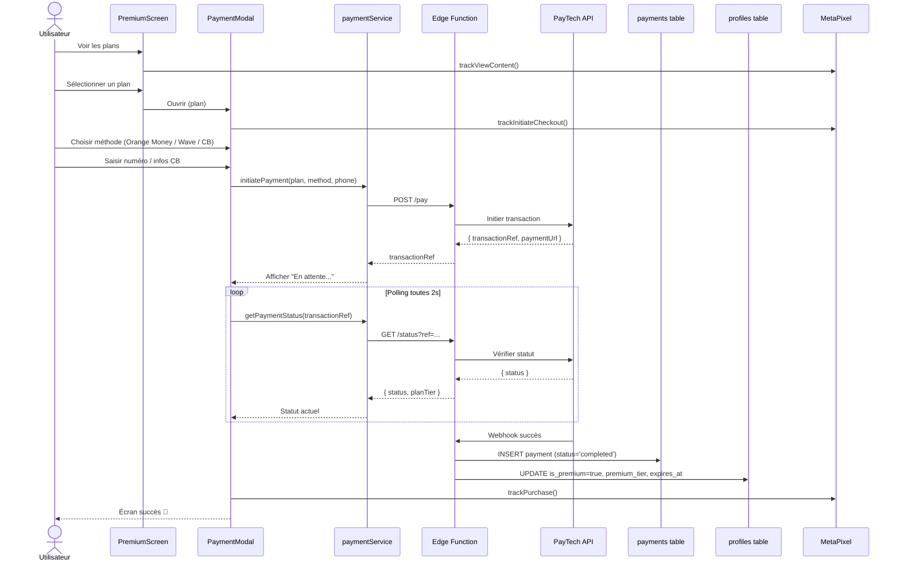

---

## 9. Schéma de base de données

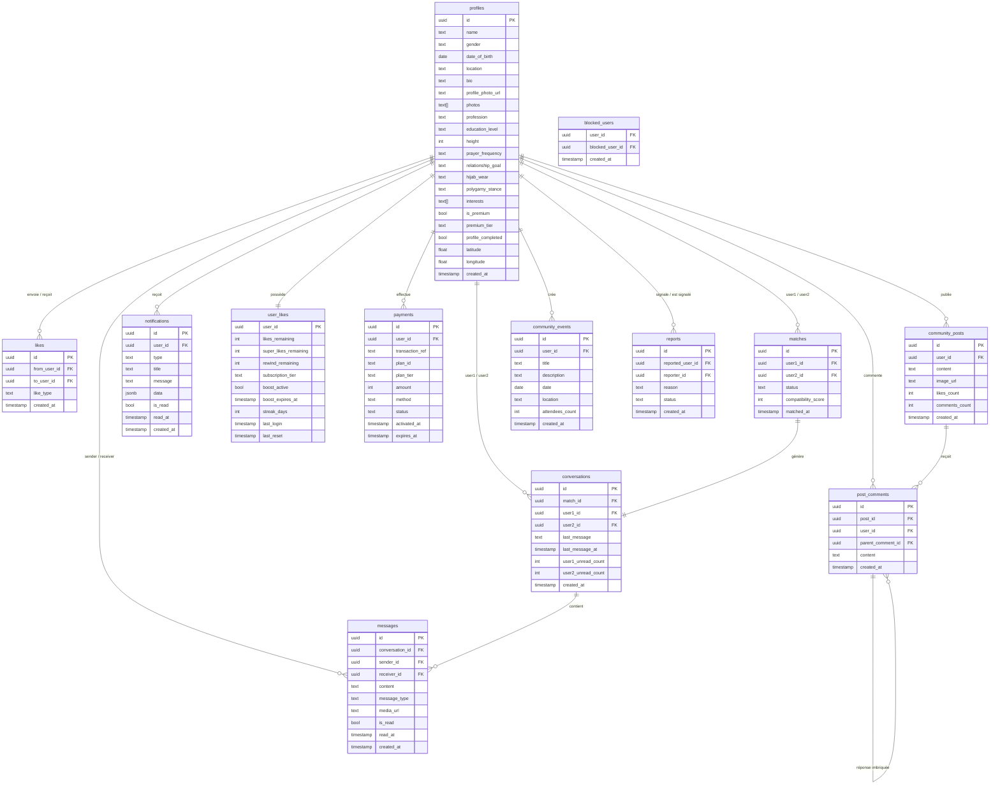

---

## 10. Composants — Arbre hiérarchique

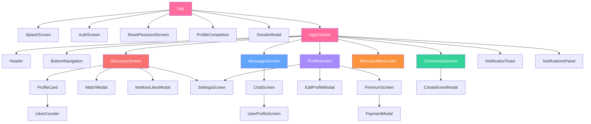

---

## 11. Hooks — Responsabilités

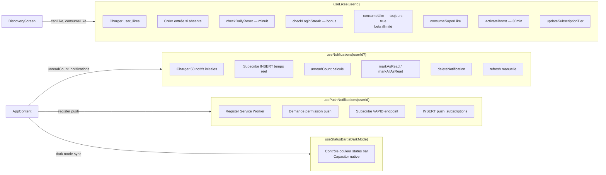

---

## 12. Plans Premium

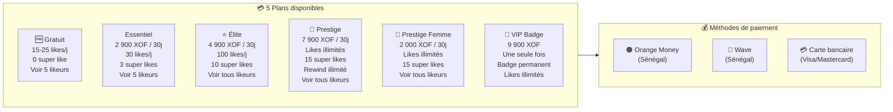

---

## 13. PWA & Service Worker

```mermaid
flowchart TD
    subgraph SW["Service Worker (sw.js) — CACHE_NAME: amali-v5"]
        Install[Install\nCache: /, /index.html, /logoamali.png]
        Activate[Activate\nSupprimer anciens caches]
        Fetch{Requête entrante}
        SupabaseFetch[Supabase → Network first]
        StaticFetch[Assets → Cache first]
        Offline[Fallback offline → index.html]
    end

    subgraph Push["Push Notifications"]
        PushEvent[Événement push reçu]
        ShowNotif[showNotification\ntitle, body, icon, badge]
        Vibrate[Vibration 200-100-200ms]
        AppBadge[navigator.setAppBadge]
        Click[NotificationClick\n→ focus window\n→ postMessage NOTIFICATION_CLICK]
    end

    subgraph Registration["Enregistrement"]
        Hook[usePushNotifications]
        Register[navigator.serviceWorker.register]
        Permission[Notification.requestPermission]
        Subscribe[pushManager.subscribe VAPID]
        SaveDB[INSERT push_subscriptions]
    end

    Hook --> Register
    Register --> Permission
    Permission --> Subscribe
    Subscribe --> SaveDB

    Install --> Activate
    Fetch -->|api.supabase.co| SupabaseFetch
    Fetch -->|assets statiques| StaticFetch
    SupabaseFetch -->|offline| Offline
    StaticFetch -->|absent| Offline

    PushEvent --> ShowNotif
    ShowNotif --> Vibrate
    ShowNotif --> AppBadge
    ShowNotif --> Click
```

---

## 14. Admin Panel

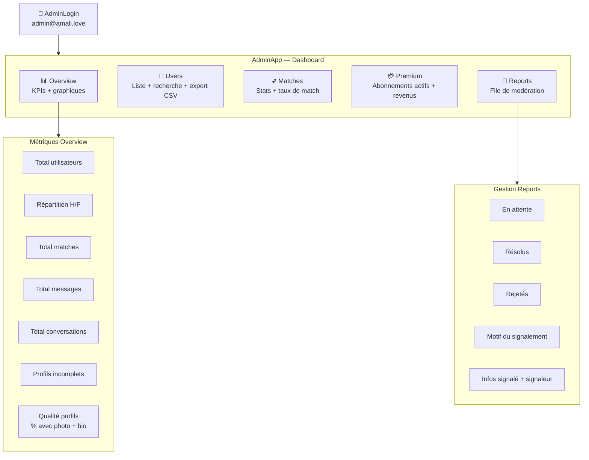

---

## 15. Tracking Meta Pixel

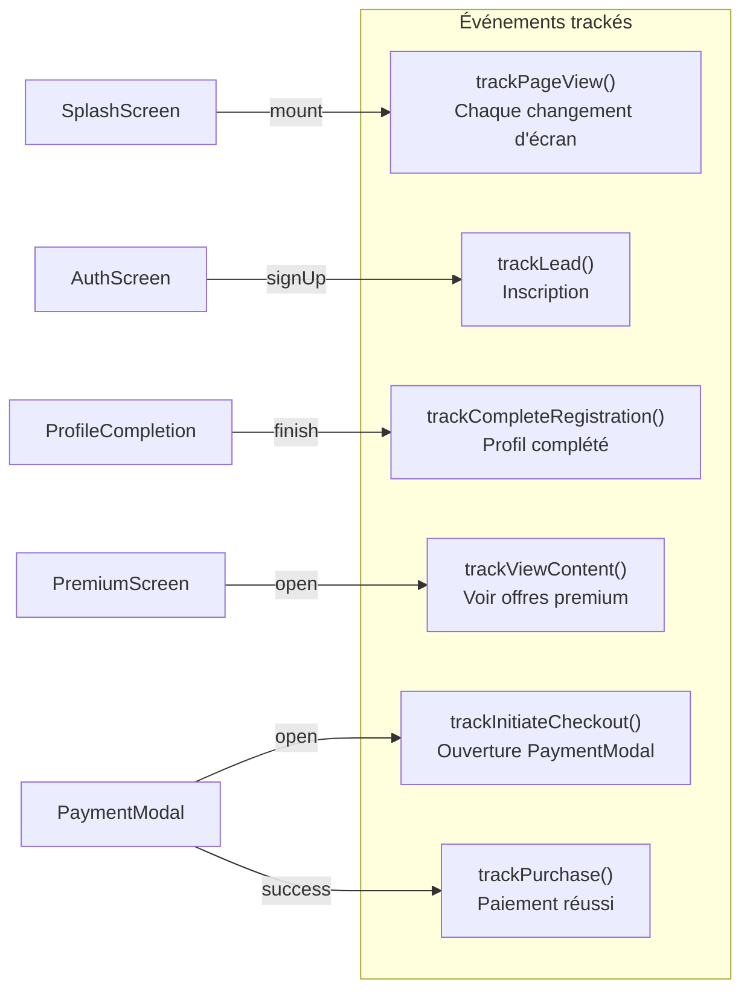

---

## 16. Gestion des images

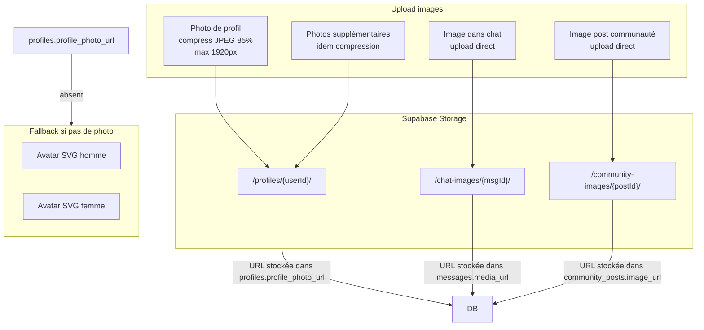

---

## 17. Sécurité & Modération

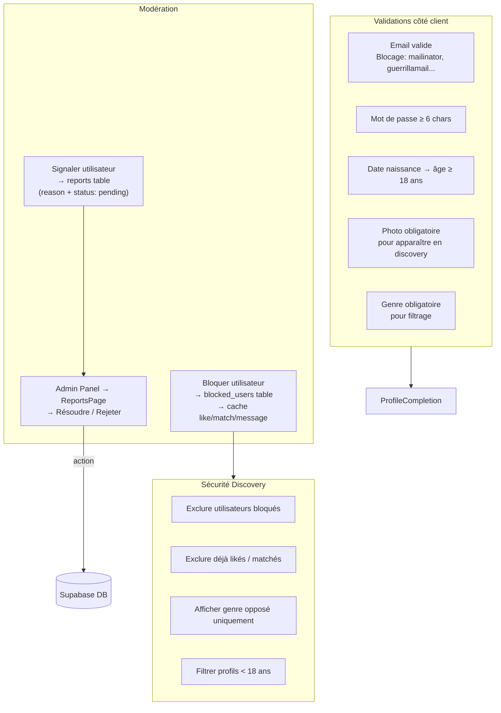

---

## Résumé technique

| Dimension | Valeur |
|-----------|--------|
| Framework | React 18 + TypeScript + Vite |
| Style | Tailwind CSS |
| Backend | Supabase (Auth + PostgreSQL + Realtime + Storage) |
| Tables DB | 19 tables |
| Composants | 33 composants UI |
| Hooks | 4 hooks personnalisés |
| Plans premium | 5 (Free / Essentiel / Élite / Prestige / Prestige Femme) |
| Paiement | PayTech (Orange Money, Wave, CB) |
| Tracking | Meta Pixel (6 événements) |
| PWA | Service Worker v5 + Push VAPID |
| Admin | 5 pages (Overview, Users, Matches, Premium, Reports) |
| Temps réel | Supabase Realtime (messages, notifications) |
| Déploiement | PWA installable (iOS + Android + Desktop) |
